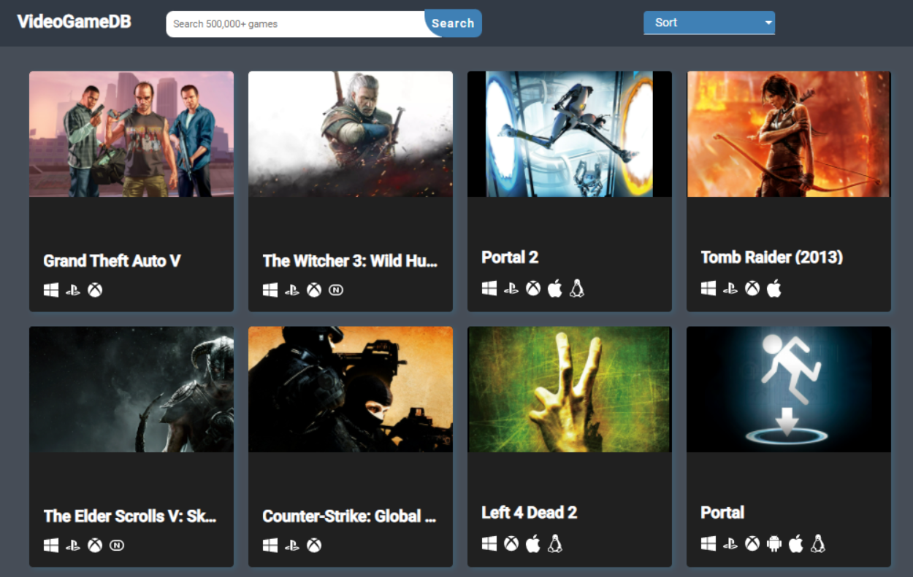

# VideoGameDb
---

A website uses a public API to create a game database website, to view games details (e.g. platforms, genres, released, screenshots and trailers if available), Using Components, Data-Binding, HTTP, Services, Interceptor.

## Build with
 - Angular CLI
 - RxJS
 - RAWG Video Games Database API
